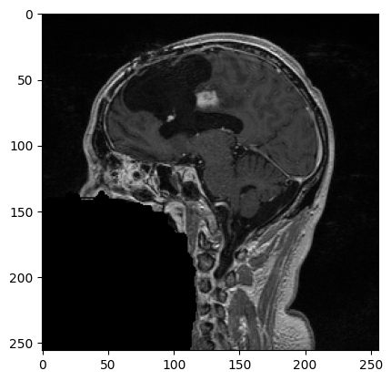
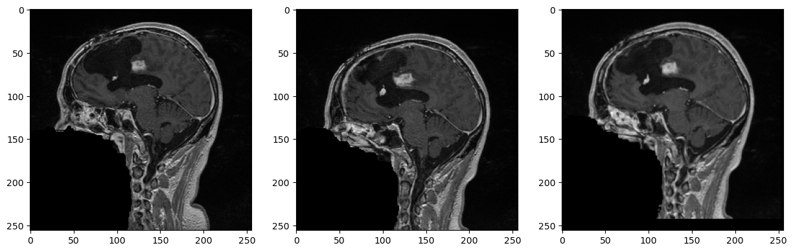
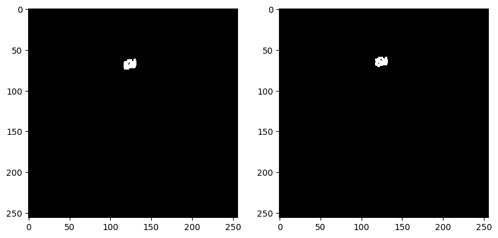

# Mini Projet ITK/VTK
## Thibault BOUTET - Jean FECHTER

## Déroulement du projet
L'objectif de ce projet était d'effectuer une étude longitudinale d'une tumeur à partir de deux scans du même patient.
Le but d'une telle étude est de déterminer l'évolution d'une tumeur afin de choisir des traitements adaptés.
Pour réaliser cette étude, nous avons suivi les étapes suivantes:
<ul>
	<li>Recalage des deux scans</li>
	<li>Segmentation de la tumeur</li>
	<li>Analyse et visualisation des changements</li>
</ul>

Pour lancé le projet: `python vtk-itk.py`

Nos expérimentations et nos visualisations intérmédiaires se trouvent dans le notebook ***research.ipynb***.

### Données
Pour ce projet, nous avions à notre disposition deux scans au format ***.nrrd**.
La lecture de ces fichiers a été faite avec une méthode similaire à celle vue en TP.

Il est à noter que pour réaliser ce projet, nous nous sommes extensivement basés sur des affichages intermédiaire de la coupe 80 de la vue sagitale. Celle-ci ce situe environ à la moitié du scan et offre une bonne visualisation d'ensemble. Cette coupe a particulièrement été utile pour vérifier nos résultats des prochaines étapes.

*Coupe 80 de la vue sagitale*

## Recalage
Etant donné que les deux scans du patient ont été réalisés à deux dates différentes, nous devions les recaler entre eux afin de pouvoir effectuer nos analyses.

Nous avons choisis de recaler le scans ***case6_gre2.nrrd*** sur le scan ***case6_gre1.nrrd***.

Pour ce faire, nous avons testé les méthodes de recalage suivantes:
<ul>
	<li>B-spline</li>
	<li>Rigide (translation)</li>
</ul>
Nous nous sommes rendu compte que le recalage rigide uniquement avec une translation donnait de très bon résulats de manière rapide. En effet, il semblerait que les deux scans diffèrent à une translation près.

*Scan 1 | Scan 2 | Scan 2 recalé*

## Segmentation
L'objectif de cette partie est de séparer la tumeur cérébrale des autres parties de l'image. Pour ce faire, nous avons utilisé la même procédure que celle vu lors des séances de TP.

Afin d'obtenir de bon résultats, nous avons du déterminer les bons paramètres de seuils et de point de départ de notre segmentation. Nous avons utilisé les paramètres suivant pour la segmentation:
<ul>
	<li>Seed-x: 60</li>
	<li>Seed-y: 80</li>
	<li>Seuil bas: 600</li>
	<li>Seuil haut: 800</li>
</ul>

*Scan2 recalé segmenté | Scan 1 segmenté*

## Analyse et visualisation
Dans cette partie, on veut pouvoir obtenir des métriques sur l'évolution de la tumeur entre les deux scans.

Nous avons choisis de calculer le volume de la tumeur dans les 2 scans et d'effectuer la différence. Ce calcul de volume repose sur le nombre de pixels segmentés et le volume correspondant à un pixel en mm³.

Voici nos résultats:
<ul>
	<li>Volume de la tumeur scan 1: 290700 mm³</li>
	<li>Volume de la tumeur scan 1: 315435 mm³</li>
	<li>Différence de volume entre les deus scans: 24735 mm³</li>
</ul>
On en déduit que la tumeur a augmenté de volume à hauteur de presque 9% entre le scan 1 et le scan 2.

Pour ce qui est de la visualisation, nous avons produit deux résultats. Dans l'éxécution du code, la deuxième s'affiche lorsque la premièer est fermée.

La première visualisation produite met en évidence les tumeurs segmentées sur les deux scans sur chaque coupe. Il est possible de se déplacer dans les coupes à l'aide du curseur de la souris.

La deuxième visualisation est une vue d'ensemble du crane du patient avec la tumeur mit en évidnce. Pour activer l'affichage la tumeur du premier scan, il faut presser la touche 'b' et presser la touche 'a' pour la tumeur du second scan. De plus, il est possible de se déplacer dans l'espace à l'aide de la souris.